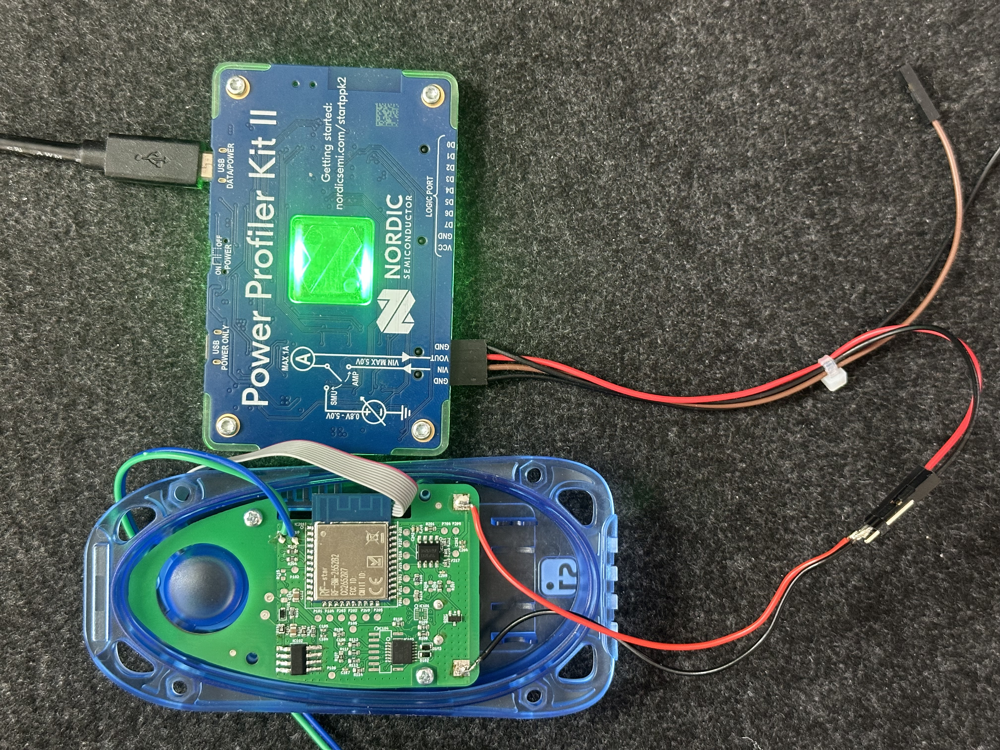

# SIReader PCB Power Consumption Test Procedure

This document describes the full procedure to measure power consumption for each SIReader PCB using a Nordic Power Profiler Kit II (PPK2) and the automation script in this repository.

## 1. Purpose

Use this procedure to:

- Power each SIReader PCB from the PPK2 in Source Meter mode.
- Capture current samples in two DUT operating phases:
  - BLE Advertisement mode: 20 seconds
  - Sleep mode: 20 seconds
- Wait 10 seconds between the two measurement phases while DUT power remains ON.
- Start a fresh sampling window for Sleep mode so BLE/transition samples are not included in the Sleep average.
- Evaluate PASS/FAIL based on configured average-current thresholds.
- Log repeatable measurement data to CSV.

## 2. Required Setup

### 2.1 Hardware

- Nordic Power Profiler Kit II (PPK2)
- SIReader PCB under test (one board at a time)
- USB cable for PPK2
- DUT wiring leads
- PC with Python installed

### 2.2 Software

- Python 3.10+ recommended
- Python dependencies listed in requirements.txt

Install dependencies:

```bash
pip install -r requirements.txt
```

Manual alternative:

```bash
pip install ppk2-api pyserial numpy
```

## 3. Repository Files

- requirements.txt: Python dependencies
- sireader_power_consumption_test.py: Automation script for measurement and CSV logging
- results.csv: Output file containing measurement summaries

## 4. Electrical Connection



Connect the PPK2 to one SIReader PCB at a time.

- PPK2 runs in Source Meter mode.
- DUT supply is set to 3600 mV by the script.
- DUT power is enabled when measurement starts.
- During the 10-second transition wait, DUT power stays ON.
- DUT power is disabled after the complete dual-phase measurement cycle finishes.

Before running measurements:

- Verify polarity and wiring.
- Verify there are no shorts.
- Ensure DUT firmware behavior matches test assumptions.

## 5. Port Selection Behavior

The script supports automatic PPK2 port detection.

- Default: SERIAL_PORT = None
- Script scans Nordic USB CDC ACM ports and selects the best candidate
- Optional manual override: set SERIAL_PORT in sireader_power_consumption_test.py (example: COM7)

## 6. Configure Test Parameters

Open sireader_power_consumption_test.py and verify:

### Measurement timing

- SOURCE_VOLTAGE_MV = 3600
- BLE_ADVERTISEMENT_DURATION_S = 20
- TRANSITION_WAIT_S = 10
- SLEEP_MODE_DURATION_S = 20

Total cycle time per test: 20 + 10 + 20 = 50 seconds (excluding startup overhead).

### PASS/FAIL thresholds (average current in microamps)

- BLE_ADVERTISEMENT_MIN_UA = 100
- BLE_ADVERTISEMENT_MAX_UA = 120
- SLEEP_MODE_MIN_UA = 1
- SLEEP_MODE_MAX_UA = 2

PASS condition:

- BLE Advertisement average current is between 100 and 120 uA
- Sleep average current is between 1 and 2 uA

If either condition fails, test result is FAIL.

## 7. Running the Test

Run from the project folder:

```bash
python sireader_power_consumption_test.py
```

Expected startup flow:

1. PPK2 is detected and connected.
2. Source Meter mode is configured at 3600 mV.
3. DUT power is OFF until Enter is pressed.
4. Prompt is shown for dual-phase measurement.

## 8. Standard Procedure Per SIReader PCB

Use this exact sequence for consistency:

1. Connect one SIReader PCB to the PPK2 test wiring.
2. Run the script.
3. Wait for the PPK2 ready prompt.
4. Press Enter to start one dual-phase measurement cycle.
5. Phase 1: BLE Advertisement mode is measured for 20 seconds.
6. Script waits 10 seconds for DUT transition to sleep (DUT power remains ON).
7. Phase 2: Sleep mode is measured using a fresh 20-second sampling window.
8. BLE Advertisement samples are not reused for Sleep mode averaging.
9. Script prints average/min/max/sample count for each phase.
10. Script prints final PASS or FAIL result.
11. Two rows are appended to results.csv (one per mode).
12. Map this test_number to the PCB identifier in your production log.
13. Connect next PCB and repeat.

Notes:

- Test number auto-increments per complete cycle.
- BLE and Sleep rows share the same timestamp and test_number.
- Press Ctrl+C to stop safely.
- On exit, measurement is stopped and DUT power is turned OFF.

## 9. CSV Output Format

results.csv columns:

- timestamp
- test_number
- mode (BLE Advertisement or Sleep)
- avg_current_uA
- min_current_uA
- max_current_uA
- sample_count

Example rows from one test cycle:

```csv
2026-03-19T10:12:33,1,BLE Advertisement,112.5512,95.1022,128.3311,120000
2026-03-19T10:12:33,1,Sleep,1.5541,0.8810,2.2205,120000
```

## 10. Production Logging Recommendation

results.csv does not store PCB serial number directly. Keep a parallel production log with:

- PCB serial number or batch ID
- Operator
- Date/time
- test_number
- BLE Advertisement average current
- Sleep average current
- PASS/FAIL decision
- Notes (firmware version, anomalies, rework)

## 11. Troubleshooting

### PPK2 not found

Symptoms:

- No PPK2 device found
- Serial open failure

Actions:

1. Reconnect USB cable.
2. Check Device Manager for PPK2 COM ports.
3. Close any tool using the COM port.
4. Verify Nordic drivers/tools are installed.
5. Retry script.

### Two COM ports are visible

This is normal on Windows. Script selects the preferred Nordic CDC ACM data port automatically.

### Serial error during measurement

Script attempts auto-reconnect. If reconnect fails:

1. Stop script.
2. Reconnect hardware.
3. Start script again.

### FAIL result or abnormal current values

Possible causes:

- Wiring/polarity issue
- DUT firmware not in expected startup behavior
- DUT not entering sleep within transition window
- PPK2 configuration issue

Recommended checks:

1. Compare with a known-good board baseline.
2. Repeat measurement for the same board.
3. Inspect DUT firmware and BLE state-machine timing.

## 12. End-of-Test Checklist

1. Confirm all PCBs were tested.
2. Confirm results.csv contains two rows per tested board.
3. Confirm each row pair is mapped to a PCB identifier.
4. Confirm PASS/FAIL was recorded for each board.
5. Archive results with date, batch, and operator info.
